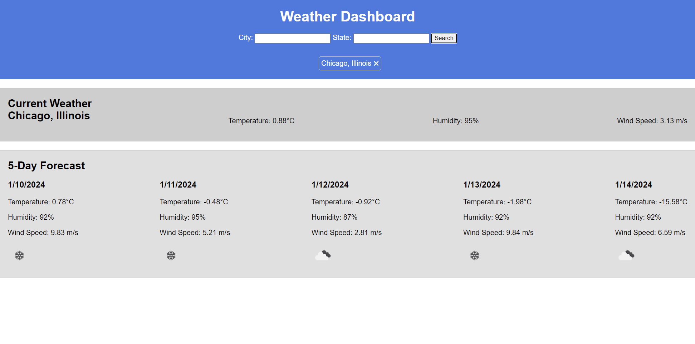

# Weather-Forecast

## Description

This is a weather dashboard application that allows users to search for the current weather and forecast for any city. The application utilizes server-side APIs to retrieve weather data from a third-party weather API.

## Acceptance Criteria

GIVEN a weather dashboard with form inputs
WHEN I search for a city
THEN I am presented with current and future conditions for that city and that city is added to the search history
WHEN I view current weather conditions for that city
THEN I am presented with the city name, the date, an icon representation of weather conditions, the temperature, the humidity, and the the wind speed
WHEN I view future weather conditions for that city
THEN I am presented with a 5-day forecast that displays the date, an icon representation of weather conditions, the temperature, the wind speed, and the humidity
WHEN I click on a city in the search history
THEN I am again presented with current and future conditions for that city

## Usage

- Enter the name of a city in the search bar and click the search button or press Enter.
- The current weather conditions and 5-day forecast for the city will be displayed.
- Saved cities can be accessed by clicking on the city name in the search history.

## Installation

Pushed the code into the github repository and deployed in into github pages. For review and grading purposes, the application is deployed at [(https://ninabuscemi.github.io/weather-forecast/)].

## Contributing

Contributions to the Weather Forecast Dashboard are welcome! If you find any issues or have suggestions for improvements, please submit a pull request. Make sure to follow the repository's code style and guidelines.